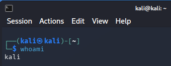
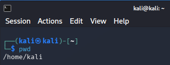
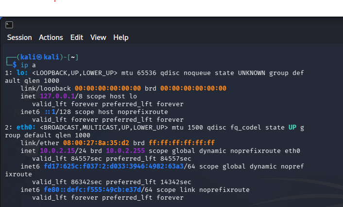
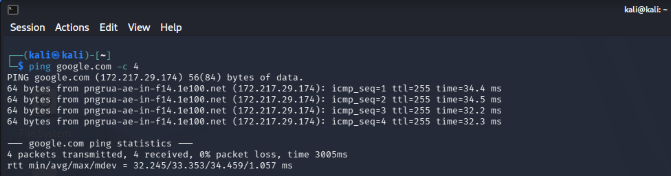
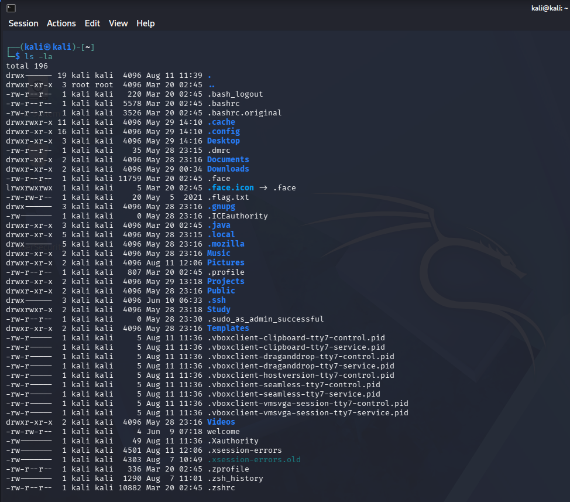

# Kali Linux Lab

## Overview

This repository documents my hands-on practice with Linux, Networking and Cybersecurity concepts using Kali Linux.

The goal of this project is to build practical experience through home lab activities while developing technical skills for IT Support, Security Operations Center (SOC) and Cybersecurity roles.

---

## Lab Environment

- Host Operating System: Windows
- Virtualization Platform: VirtualBox
- Guest Operating System: Kali Linux

---

## Topics Covered

- Linux Fundamentals
- User Management
- File Permissions
- Networking Basics
- Troubleshooting
- System Administration
- Cybersecurity Fundamentals

---

## Lab Activities

### User Identification

Command used:
`whoami`

Purpose:
Identify the currently logged-in user.

  
📸 Click to view evidence

   
  

---

### Current Directory

Command used:
`pwd`

Purpose:
Display the current working directory.

  
📸 Click to view evidence

   
  

---

### Network Information

Command used:
`ip a`

Purpose:
Display network interfaces and IP address configuration.

  
📸 Click to view evidence

   
  

---

### Connectivity Test

Command used:
`ping google.com -c 4`

Purpose:
Verify network connectivity and DNS resolution.

  
📸 Click to view evidence

   
  

---

### File Listing

Command used:
`ls -la`

Purpose:
Display detailed information about files and directories, including hidden files.

  
📸 Click to view evidence

   
  

---

## Project Status

🚧 In Progress

This repository will be continuously updated as new Linux, Networking and Cybersecurity topics are explored.